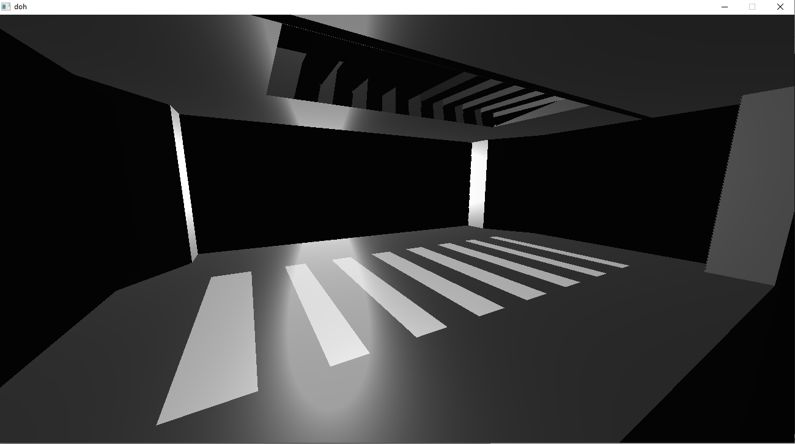
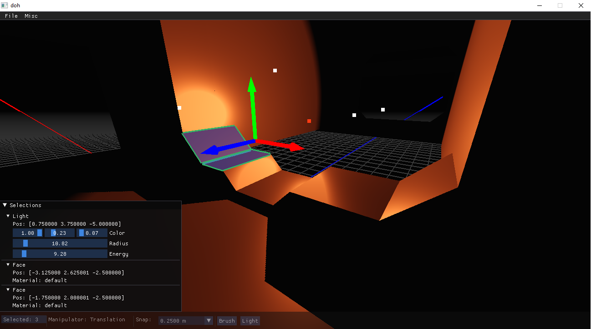

# Stealthy

## Brief

This is a 3d, fps oriented, game engine and level editor being built for the 7dfps game jam. The engine and editor are written in C11, and currently use OpenGL as graphics API.

It's possible to play the current level in the editor (although there isn't much happening in those screenshots).

It's also possible to edit brush parts (only faces for now. Edges and vertices are to come).

The "phylosophy" of the editor is to maximize viewport space by hiding most of the UI, but to have most of the UI immediately accessible, either through a key combination, or through the least amount of menu traversion.

Modifying parameters of selected objects happens in the selection window, which stays pretty much out of the way.

Different objects display different parameters (naturally). The menu allows editing all selected objects, instead of only the last one.

## Features

**The engine currently features:**
- Rendering
	- Clustered forward shading
	- Point lights
	- Shadow mapping
	- Normal mapping
	- Matrix pallete skinning
- Animation
	- Matrix pallete skinning
	- Animation mixing
	- Bone groups (to have animations affect only part of a skeleton)
	- Direct access to bone transforms, for programmatic control of joint orientations
- Sound (simple OpenAL backend)
- GUI
	- Dear ImGui

**The editor currently features:**
- Map editor
	- Brush workflow
		- Creation/deletion/copying of brushes
		- Translation/rotation of brush objects
		- Translation/rotation of brush faces/edges/vertices
	- Object placement
		- Lights (incomplete)
	- Level serialization/deserialization

**Things in the engine roadmap:**
- Rendering
	- Static geometry bsp
	- Movable geometry DBVH
	- Frustum culling
	- Occlusion culling
	- Spotlights
	- Area lights
	- Soft shadows
	- Antialising
	- Parallax occlusion mapping
	- Ditch OpenGL and go the Vulkan way
- Physics
	- Character controller
	- Rigid body dynamics (not really necessary for this jam)
	- Triggers
- Scripting (not really necessary for this jam)

**Things in the level editor roadmap:**
- Map editor
	- Brush workflow
		- Face/edge extrusion/deletion
		- CSG operations
		- Setting the material of a face
	- Object placement
		- Proper light placement
		- Entity placement
- Entity editor (not really necessary for this jam)
